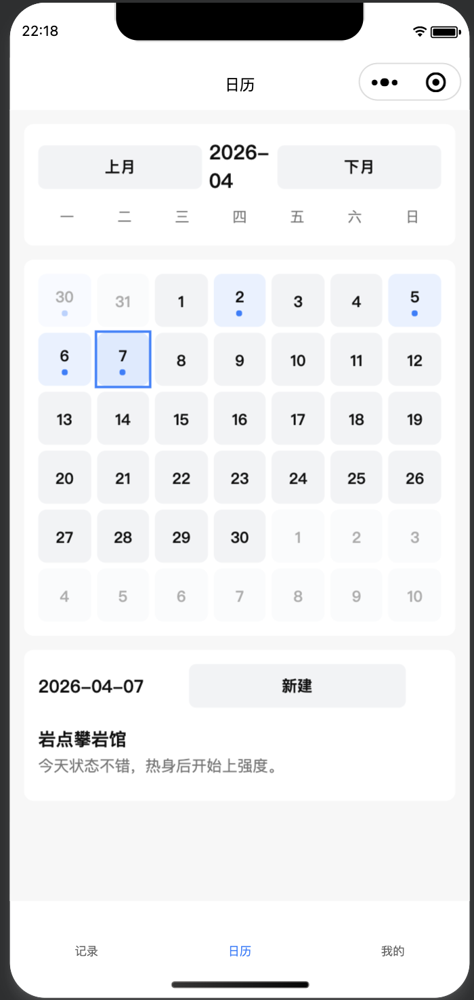

## 攀岩日记（小程序）

记录攀岩的日期、攀岩馆（高德 POI 模糊搜索）和心得，并提供列表与日历高亮查看。

### 预览

> 将预览图放在 `docs/preview.png`（仓库默认已保留 `docs/` 目录占位）。  

### 项目结构
- `miniprogram/`：微信小程序端（本地记录 + 日历 + POI 搜索）
- `server/`：后端代理（保护高德 Key，提供 `/api/poi/*`）

### 开发说明
见 `README_dev.md`。

